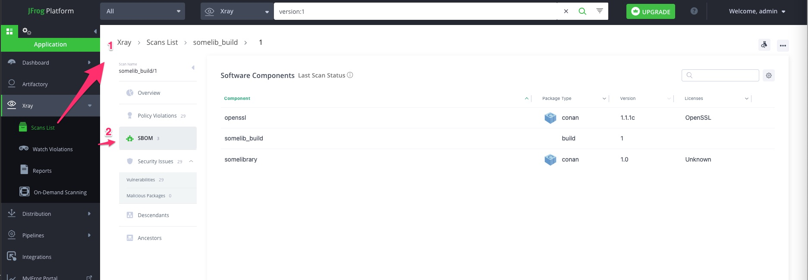
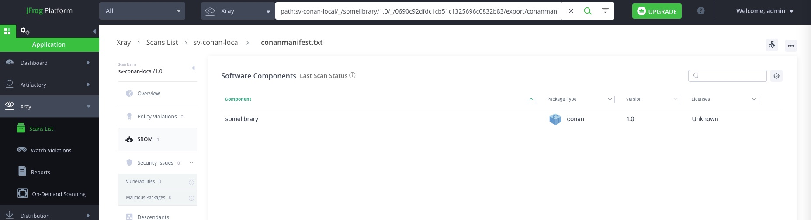

## Create an SBOM from BuildInfo in Artifactory demo

This repository serves as a demonstration for generating Software Bill of Materials (SBOM) using Conan package manager. The sample application is forked from [czoido/sbom-generation-demo](https://github.com/czoido/sbom-generation-demo) with fake libraries. One of the libraries included is openssl, which is reported to have vulnerabilities, and the SBOM report helps in identifying it.

Follow the steps and substitute the ``<>`` placeholders with your own information

```
# <conan_remote_name> --> use the name of the remote in Conan (it may not be the same with the name in Artifactory, this is the name you get with 'conan remote list')
# <artifactory_repo_name> --> this is the name of the repository in Artifactory that is configured in Conan
# <artifactory_url> --> url for Artifactory, something like 'https://whatever/artifactory'
# <user> and <password> for the Artifactory repo
```

### How to build a conan 2.0 project:
Please review :
- [conan 2.0 extension commands](https://github.com/conan-io/conan-extensions/blob/main/extensions/commands/art/README.md)  
- publish to JFrog Artifactory https://docs.conan.io/2/integrations/jfrog.html 

Example conan project is in https://blog.conan.io/2023/05/11/tensorflow-lite-cpp-mobile-ml-guide.html

Install conan2.0  using steps in https://docs.conan.io/2/installation.html
```
pip install conan cmake
```
**Note:** Make sure you have the C/C++ compiler installed. On `Windows 2022` instance you can install `Visual Studio 2022`.

Otherwise the `"conan create .."` commands  can fail with:
`Invalid: 'settings.compiler' value not defined`

For more details on `'settings.compiler'` please review
- https://docs.conan.io/2/reference/config_files/profiles.html
- https://docs.conan.io/2.0/reference/commands/profile.html

---
In Powershell if the `"conan create .."` commands  fail with error `CMake Error: CMAKE_C_COMPILER not set , after EnableLanguage`

It means that CMake cannot find the C compiler required to compile your project. This error often occurs when the C compiler (such as GCC or Clang) is not installed or not properly configured in your system environment.


If you install [Mingw-w64](https://www.mingw-w64.org/)  for the GCC compiler on Windows systems and use Powershell,
make sure to set the `gcc` in PATH using:
```
$env:PATH -split ';'
$env:PATH = $env:PATH + ';<PATH to mingGW bin folder>'
```
More permanent steps to set the PATH is mentioned in  
[Setting Windows PowerShell environment variables - DEV Community](https://dev.to/asmitbm/setting-windows-powershell-environment-variables-2glb) as in [misc_scripts/add_Folder_to_path_in_ps1](misc_scripts/add_Folder_to_path_in_ps1)

Now the following command should work:
```
gcc --version
```

---

Next run:
```
conan profile detect
```
This creates a  Profile `/Users/sureshv/.conan2/profiles/default` on unix platforms ( on windows the file is `C:\Users\sureshv\.conan2\profiles\default`) which you can find later using:
```
conan profile path default
```
On my mac where the generated `/Users/sureshv/.conan2/profiles/default` had the following content:
``` 
[settings]
arch=x86_64
build_type=Release
compiler=apple-clang
compiler.cppstd=gnu17
compiler.libcxx=libc++
compiler.version=15
os=Macos
```
---
**Note:** Make sure the profile has settings.compiler set as discussed in
- https://github.com/conan-io/conan/issues/14064
- https://github.com/conan-io/conan/issues/14575
- https://github.com/conan-io/conan/issues/13345
- https://stackoverflow.com/questions/17275348/how-to-specify-new-gcc-path-for-cmake


---
### Install the build info extension commands 
See steps in https://docs.conan.io/2/integrations/jfrog.html

Using the dedicated repository for Conan extensions https://github.com/conan-io/conan-extensions, it is as easy as:
```
conan config install https://github.com/conan-io/conan-extensions.git -sf=extensions/commands/art -tf=extensions/commands/art
```
The extension files get copied to  `C:\Users\sureshv\.conan2\extensions\commands\art`

---
### Steps:


## Deploying to Artifactory Instance

To build the Conan application and upload to the Artifactory instance referred by server-id `proservicesone` using  `build name` *somelib_build* and `build number` *1* , then index and scan the build in Xray and generate a SBOM follow these steps:

### Add Build to Xray Indexed Resources

Run the following command to add build to Xray indexed resources:

```bash
curl -XPOST -u admin:YOUR-PASSWORD https://proservicesone.jfrog.io/xray/api/v1/binMgr/builds -H 'content-type:application/json' -d '{"names": ["build-name"]}'
```

or using jfrog CLI:

```bash
jf xr curl -XPOST api/v1/binMgr/builds -H 'content-type:application/json' -d '{"names": ["somelib_build"]}'  --server-id=proservicesone
```

#### With Windows command Prompt:
curl or  jf with curl  works wiht below syntax to escape double quotes inside json:
```bash
jf xr curl -X POST api/v1/binMgr/builds  -d "{\"names\": [\"somelib_build\"]}"  -H "Content-type:application/json"

Or

curl -X POST   -H "Content-type:application/json" https://proservicesone.jfrog.io/xray/api/v1/binMgr/builds -T somebuild.json -H "Authorization: Bearer YOUR-ACCESS-TOKEN"


```

#### With Powershell:
[Powershell: passing json string to curl - Stack Overflow](https://stackoverflow.com/questions/24745868/powershell-passing-json-string-to-curl)
Try using the `--%` operator to put PowerShell into simple (dumb) argument parsing mode:
This is quite often useful for invoking exes with argument syntax that runs afoul of PowerShell's argument syntax. This does require PowerShell V3 or higher.
```bash
jf xr curl --% -X POST api/v1/binMgr/builds  -d "{\"names\": [\"somelib_build\"]}"   -H "Content-type:application/json"
```

### Create Repositories

Navigate to the `create_repositories` directory and create  repositories from the exported configurations:

```bash
cd create_repositories

jf rt curl  -X PUT api/repositories/sv-conan-local -H "Content-Type: application/json" -T sv-conan-local-config.json --server-id=proservicesone
jf rt curl  -X PUT api/repositories/sv-conan-remote -H "Content-Type: application/json" -T sv-conan-remote-config.json --server-id=proservicesone
jf rt curl  -X PUT api/repositories/sv-conan-virtual -H "Content-Type: application/json" -T sv-conan-virtual-config.json --server-id=proservicesone
```
---

For your Conan commandline client to work with this Conan virtual repository, you first need to add the repository to your client configuration using the following command:

**Note:** This config saved in the `/Users/sureshv/.conan2/remotes.json` file in unix systems and 
`C:\Users\sureshv\.conan2\remotes.json` in Windows .

```
conan remote add sv-conan-virtual https://proservicesone.jfrog.io/artifactory/api/conan/sv-conan-virtual
```
To Login use the command from the conan virtual repo's  `Set Me Up`:
```
conan remote login sv-conan-virtual <username> -p <token>

For Example:
conan remote login sv-conan-virtual admin -p cmVmdGtuOjAxOjE3Ndummy

```
Output:
```
Changed user of remote 'sv-conan-virtual' from 'None' (anonymous) to 'admin' (authenticated)
```
---

Configure  conan to use  the Artifactory Server as proservicesone
```
conan art:server remove proservicesone

conan art:server add proservicesone \
https://proservicesone.jfrog.io/artifactory --user=admin \
--password=cmVmdGtuOjAxOjE3Ndummy
```
output:
```
Server 'proservicesone' (https://proservicesone.jfrog.io/artifactory) added successfully
```
---

### Configure Xray Index and Retention Policy

Set the Xray index and retention policy for the local and remote repositories to 91 days:

```bash
jf xr curl -XPUT api/v1/repos_config -H "Content-Type: application/json" -d '{"repo_name": "sv-conan-local","repo_config":{"retention_in_days":91}}' --server-id=proservicesone
jf xr curl -XPUT api/v1/repos_config -H "Content-Type: application/json" -d '{"repo_name": "sv-conan-remote","repo_config":{"retention_in_days":91}}' --server-id=proservicesone
```

### Create Policy and Watch

Execute the following commands to create a policy and watch:

```bash

cd ../xray_watch_policy

jf xr curl -XPOST -H "Content-Type: application/json" api/v2/policies -T all-sev-sec.json --server-id proservicesone

jf xr curl -XPOST -H "Content-Type: application/json" api/v2/watches -T sv-all-sev-sec_watch.json --server-id proservicesone
```

### Building the Application

To build the application, follow these steps:

```bash
cd ~/myCode/github-sv1/

git clone https://github.com/sureshvenkatesan1/conan-sbom-generation-demo.git
cd conan-sbom-generation-demo

# Clean from previous runs
# Note: -r is the virtual repo

conan remove "somelibrary*" -r=sv-conan-virtual -c
conan remove "openssl/1.1.1c*" -r=sv-conan-virtual -c
conan remove "openssl/1.1.1c*" -c
conan remove "somelibrary*" -c
```


### Fake openssl
```
conan create openssl --build="openssl/1.1.1c*"
conan upload "openssl/1.1.1c*" -r=sv-conan-virtual -c
conan create somelibrary --format=json --build="somelibrary*" -r=sv-conan-virtual > create_output.json
conan upload "somelibrary*" -r=sv-conan-virtual -c
```
**Note:** If a `conan create ...` command above fails with the error
`ImportError: cannot import name 'ConanFile' from 'conans'`  like below for your app:
```
======== Exporting recipe to the cache ========
ERROR: Error loading conanfile at 'C:\Users\testuser\Test\falcon\conanfile.py': Unable to load conanfile in C:\Users\testuser\Test\falcon\conanfile.py
  File "<frozen importlib._bootstrap>", line 228, in _call_with_frames_removed
  File "C:\Users\testuser\Test\falcon\conanfile.py", line 5, in <module>
    from conans import ConanFile
ImportError: cannot import name 'ConanFile' from 'conans' (C:\Users\testuser\AppData\Local\Conan\conan\_internal\conans\__init__.pyc)
```
it is because you are using a legacy Conan 1 recipe as in [older_conanv1_stuff/conanfile.py](older_conanv1_stuff/conanfile.py) .
You need to update the recipe to make it compatible with Conan 2 .

For this please review the migration guide in https://docs.conan.io/1/conan_v2.html  , starting with the steps in
[Python import statements](https://docs.conan.io/1/migrating_to_2.0/recipes.html#python-import-statements)

**Note:** As mentioned in [119#issue comment](https://github.com/conan-io/conan-extensions/issues/119#issuecomment-2006635811) pass the local repo as argument when generating the buildInfo instead of the virtual repo:

```bash
# Create the buildInfo file.
conan art:build-info create create_output.json somelib_build 1 sv-conan-local --server proservicesone --with-dependencies > somelib_build.json

# Publish the buildInfo file
conan art:build-info upload somelib_build.json --server proservicesone

# Backup or delete the temp files
mv -f create_output.json output/
mv -f somelib_build.json output/
```
Since the repos and the build are  already indexed Indexed by Xray , go the `Xray > Scans List` to view the SBOM for the build run:


Similarly the published artifact SBOM shows:


---

## Other useful Xray Rest APIs:

### How to Scan an artifact ?
a) Use the “[Scan Artifact](https://jfrog.com/help/r/jfrog-rest-apis/scan-artifact)” API

```
curl -H "Authorization: Bearer $MYTOKEN" \
-XPOST "https://soleng.jfrog.io/xray/api/v1/scanArtifact" \
-H "Content-Type: application/json" \
-d '{ "componentID": "docker://image_name:image_tag"}'
```

Output:
```
{
 "info": "Scan of artifact is in progress"
}
```
or

b) Use the “[Scan Now](https://jfrog.com/help/r/jfrog-rest-apis/scan-now)” API , the enables  you to index resources on-demand, even those that were not marked for indexing

```
curl -H "Authorization: Bearer $MYTOKEN" \
-XPOST "https://soleng.jfrog.io/xray/api/v2/index" \
-H "Content-Type: application/json" \
-d '{   
  "repo_path":"local-maven-repo/org/jenkins-ci/main/jenkins-war/2.289.1/jenkins-war-2.289.1.war"
}'
```

Output:
```
{
   "sent_to_reindex": {
       "artifacts": [
           {
               "repository": "local-maven-repo",
               "path": "org/jenkins-ci/main/jenkins-war/2.289.1/jenkins-war-2.289.1.war"
           }
       ]
   }
}
```
Then get the scan status  using [Artifact Scan Status](https://jfrog.com/help/r/jfrog-rest-apis/artifact-scan-status) API  
```
curl -H "Authorization: Bearer $MYTOKEN" \
-XPOST "https://soleng.jfrog.io/xray/api/v1/artifact/status" \
-H "Content-Type: application/json" \
-d '{
  "repo": "docker-local",
  "path": "desktop-storage/1.0/manifest.json"
}'
```
or

Use the [Scan Status](https://jfrog.com/help/r/jfrog-rest-apis/scan-status) API
```
curl -H "Authorization: Bearer $MYTOKEN" \
-XPOST "https://soleng.jfrog.io/xray/api/v1/scan/status/artifact" \
-H "Content-Type: application/json" \
-d '{
   "repository_pkg_type": "Npm",
   "path": "npm-local/static-module-3.0.4.tar.gz",
   "sha256": "b0a887f6e5c16134b7d1280c2150d38811357642d56c622c6f7f6b239f668608",
   "sha1": "2ed14fc6f7899d089cd5a2b880121d9467c32d46"
}'
```

---
### Force the reindex of the build using [Force Reindex](https://jfrog.com/help/r/xray-rest-apis/force-reindex):
```
jf xr curl -XPOST  /api/v1/forceReindex -H 'content-type:application/json'  --server-id=proservicesone -d '{
    "artifactory_id": "default",
    "builds": [
        {
            "name": "somelib_build", 
            "number": "1"
        }
    ]
}'
```
Output:
```
{"sent_to_reindex":{"builds":[{"name":"somelib_build","number":"1","build_repo":"artifactory-build-info"}]}}
```
---

### Do a build scan

There are 2 ways to scan the build.

[Scan Build V1](https://jfrog.com/help/r/jfrog-rest-apis/scan-build-v1) : POST /api/v1/scanBuild

vs

[Scan Build V2](https://jfrog.com/help/r/xray-rest-apis/scan-build-v2) : POST /api/v2/ci/build

As per [Scanning Published Builds](https://jfrog.com/help/r/jfrog-cli/scanning-published-builds)
``` 
jf bs somelib_build 1 --server-id=proservicesone
or
jf build-scan somelib_build 1 --server-id=proservicesone
```
runs the  `Scan Build V2` POST  xray api.
```
jf xr curl -XPOST /api/v2/ci/build  -H "Content-Type: application/json"  --server-id=proservicesone \
-d '{
 "build_name": "somelib_build",
 "build_number": "1"
}'
```
We strongly recommend moving to using the v2 version of the scan build API. This API scans build-info with Xray directly, without using Artifactory as a proxy.

Output:
```
{"summary":{"total_alerts":0,"fail_build":false,"message":"No Xray “Fail build in case of a violation” policy rule has been defined on this build. The Xray scan will run in parallel to the deployment of the build and will not obstruct the build. To review the Xray scan results, see the Xray Violations tab in the UI.","more_details_url":""},"alerts":[],"licenses":[]}
```
---

### Get the Build Scan status:

Use the [Scan Status](https://jfrog.com/help/r/jfrog-rest-apis/scan-status) i.e (/api/v1/scan/status) API
```
jf xr curl -XPOST "/api/v1/scan/status/build" -H "Content-Type: application/json" --server-id=proservicesone \
-d '{ "name": "somelib_build", "version": "1"}'
```

Output:
```
{"status":"scanned","is_impact_paths_recovery_required":false}
```

For Builds you can also use the “[Build Scan Status](https://jfrog.com/help/r/jfrog-rest-apis/build-scan-status)” (/api/v1/build/status) API.
```
jf xr curl -H "Content-Type: application/json" \
-XPOST "/api/v1/build/status" --server-id=proservicesone \
-d '{ "name": "somelib_build", "number": "1"}'
```
Output:
```
{"overall":{"status":"DONE","time":"2024-03-22T01:20:30Z"},"details":{"sca":{"status":"DONE","time":"2024-03-22T01:20:28Z"},"violations":{"status":"DONE","time":"2024-03-22T01:20:30Z"}}}
```

---

### Get the build scan results

Use the GET option of the [Scan Build V2](https://jfrog.com/help/r/xray-rest-apis/scan-build-v2)
```
jf xr curl -XGET /api/v2/ci/build/somelib_build/1  --server-id=proservicesone
```
Output:
```
{"info":"No Xray “Fail build in case of a violation” policy rule has been defined on this build. The Xray scan will run in parallel to the deployment of the build and will not obstruct the build. To review the Xray scan results, see the Xray Violations tab in the UI."}
```

Note:
When you run:
```
jf xr curl -XGET "/api/v2/ci/build/somelib_build/1?include_vulnerabilities=true" --server-id=proservicesone | jq | grep -i violation
```
It returns all the `vulnerabilities` i.e CVEs but no violations i.e it shows `"violations": []`  , though   in  UI it shows both the  vulnerabilities and violations.
```
jf xr curl -XGET "/api/v2/ci/build/somelib_build/1?include_vulnerabilities=true" --server-id=proservicesone -s | jq | grep -i "cve\":" | wc -l

Output: 29
```


Note: The [Build Summary](https://jfrog.com/help/r/jfrog-rest-apis/build-summary) API might be helpful  to see the CVE details as well.
```
jf xr curl -XGET "/api/v1/summary/build?build_name=somelib_build&build_number=1" --server-id=proservicesone -s | jq | grep -i "cve\":" | wc -l

Output: 29
```
This output also does not have any violations[].

---
### How to get the list of Violations in a Build , similar to the Violations you see in the UI  ?
Use the [Get Violations](https://jfrog.com/help/r/xray-rest-apis/get-violations) API and pass the build as the filter as shown below:

```
jf xr curl -H "Content-Type: application/json" \
-XPOST "/api/v1/violations" --server-id=proservicesone -s \
-d '{
  "filters": {
     "resources": {

      "builds": [
        {
          "name": "somelib_build",
          "number": "1"
        }
      ]
   }
  },
  "pagination": {
    "order_by": "created",
    "direction": "asc",
    "limit": 100,
    "offset": 1
  }
}' | jq | bash display_violations.sh
```

---

# Software Bill of Materials (SBOM)

A Software Bill of Materials (SBOM) is a comprehensive list of components comprising a piece of software, accompanied by relevant metadata such as licensing information. It includes:

- Open source libraries that an application imports or depends on.
- Plugins, extensions, or other add-ons utilized by an application.
- Custom source code developed in-house by developers.
- Information regarding versions, licensing status, and patch status of these components.

For more details, refer to [Best Practices for Software Bill of Materials Management](https://jfrog.com/devops-tools/article/best-practices-for-software-bill-of-materials-management).

Automated SBOM Creation:
Automating SBOM creation offers benefits to both developers and product owners. 
- It eliminates the need for manual SBOM generation, enabling "machine-speed" SBOM generation as advocated by the National Telecommunications and Information Administration. 
- Additionally, automated SBOMs generated as part of the CI/CD process can be cryptographically signed and verified. Component details can be exported using REST API. 
Refer to [Export Component Details via REST API](https://jfrog.com/help/r/jfrog-rest-apis/export-component-details).

## SBOM for Artifact:

[sbom_for_artifact.sh](sbom_for_artifact.sh) is a script to download SBOM in CycloneDX format. Users can customize options based on their requirements:


## SBOM for Build:

[sbom_for_build.sh](sbom_for_build.sh) is a script to download SBOM in SPDX format. Users can customize options based on their requirements:


---

### How to get the vulnerability details of the whole Repo  or Project ?
Use the reports APIs in https://jfrog.com/help/r/jfrog-rest-apis/reports 

Reports can also be generated in the UI if you prefer.

If you encounter the error message "Artifact doesn't exist or is not indexed/cached in Xray," you should prepend "default" before the artifact path as "default/libs-release-local/com/dell/devops/config/dell-config-server/2.0.0-RELEASE/dell-config-server-2.0.0-RELEASE.jar." If you continue to face the same error, please follow these steps: 

- Go to the Artifactory UI.

- Navigate to Administration -> Services | Artifactory -> Config descriptor.

- Within the <xrayConfig> tag, locate the value of the <artifactoryId> tag.

- Replace "default" in the path with the value you found in <artifactoryId>. 

- For instance, if the <artifactoryId> value is "artifactory," then the updated path will be "artifactory/libs-release-local/com/example/devops/config/example-config-server/2.0.0-RELEASE/example-config-server-2.0.0-RELEASE.jar."


---

